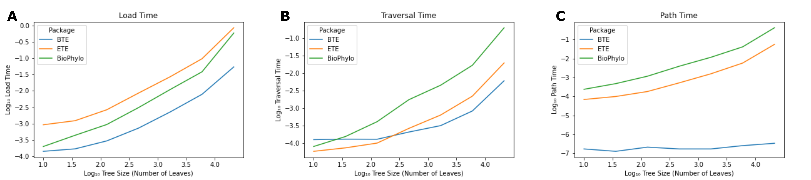

# Summary

The massive scale of the worldwide SARS-CoV-2 genome sequencing effort has driven substantial innovation in bioinformatics [@hodcroft_want_2021], including the development of new highly-scalable approaches to construction and storage of phylogenetic trees. Among these critical innovations is the mutation-annotated tree (MAT), which can compress millions of samples into a highly compact data structure [@mcbroome_daily-updated_2021; @turakhia_ultrafast_2021]. MAT-storing protocol buffers are now regularly being created and used for tracking SARS-CoV-2 lineages [@mcbroome_daily-updated_2021], and [can be freely obtained from UCSC by anyone](http://hgdownload.soe.ucsc.edu/goldenPath/wuhCor1/UShER_SARS-CoV-2/), but there are relatively few tools capable of directly working with these files.

Big Tree Explorer (`BTE`) is a Python extension of the highly optimized Mutation Annotated Tree (MAT) C++ library, which underlies the popular and highly effective phylogenetics tool UShER. `BTE` is written in Cython and provides an efficient and intuitive interface for traversing and manipulating mutation-annotated trees in a Python environment. It can load a mutation-annotated tree structure directly from a MAT protocol buffer file, provided by UCSC, or from a Auspice-format JSON. Alternatively, it can automatically infer mutation annotations and create a MAT from a Variant Call Format (VCF) file and a Newick format tree file. `BTE` provides all forms of standard traversal and methods for tree manipulation, including node and mutation creation, relocation, and deletion. `BTE` also provides native support for node-level clade and lineage annotations, such as those included in UCSC SARS-CoV-2 MAT protocol buffers. `BTE`'s Cython code also includes functionality not present in the original MAT library, such as nucleotide diversity estimation. Altogether, `BTE` provides much of the same basic tree-level functionality as competing packages, while also supporting mutation and lineage annotations, allowing any user to take advantage of the powerful MAT data structure.

`BTE` is intended for use by developers, epidemiologists, and data scientists. It can be a critical element in prototyping new phylogenetic methods, support scripts for manipulation and extraction of epidemiological information from SARS-CoV-2 genetic sequences, and much more. 

# Statement of Need

While there are multiple Python packages for phylogenetics available [@huerta-cepas_ete_2016; @talevich_biophylo_2012], none are designed with mutation-annotated trees in mind and are less optimized for scalability. When attempting to use these packages with mutation-annotated trees, cumbersome file conversions to Newick and separate storage of mutations and tree structures adds substantial overhead to any analysis. `BTE` is designed explicitly for working with extremely large mutation-annotated parsimony phylogenetic trees. It is both more computationally efficient than competing packages \autoref{fig:bench} and stores mutations and the tree within a streamlined data structure. `BTE` makes MATs and pandemic-scale phylogenies in general more accessible and useful to developers worldwide, helping to widen the SARS-CoV-2 bioinformatics bottleneck.

# Comparison with Gold-Standard Alternatives

We compared performance of `BTE` as compared to two other popular packages for Python phylogenetics, ETE3 and Biopython.Phylo [@huerta-cepas_ete_2016; @talevich_biophylo_2012]. Benchmarking was performed by extracting random subtrees of the specified size from one of UCSC’s global SARS-CoV-2 MATs, converting the subtree to Newick format, and performing the specified operation with each package. We both tracked total computation time and profiled memory use for each tool. Generally, BTE loads and traverses a tree more quickly than competitors, with a particular advantage at large tree sizes. It also has a substantially improved implementation for identifying the ancestors associated with a given node, with multiple orders of magnitude improvement. In terms of memory use, it is generally comparable to both ETE3 and Biopython.Phylo, with memory use ranging in the dozens of Kb for most operations, with up to a few hundred Mb for loading and large subtreeing operations. All code for benchmarking is available at a dedicated [repository](https://github.com/jmcbroome/bte-benchmark).

# Acknowledgements

We gratefully acknowledge our early adopters, including Alex Kramer and Will Dumm, who provided invaluable feedback and suggestions to make this package as effective, intuitive, and bug-free as possible. This work was supported by T32HG008345 and partially by the CDC award BAA 200-2021-11554. 

# References

